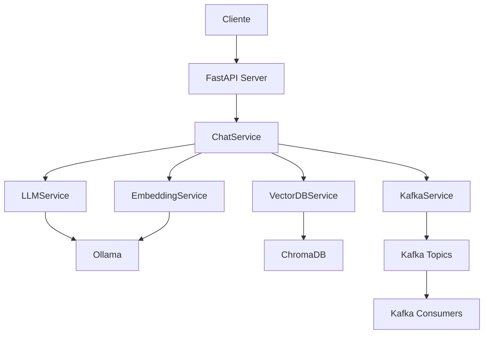

# 🤖 AI Server - Sistema Integrado con LangChain, Ollama y Kafka

Sistema completo de inteligencia artificial que combina **FastAPI**, **LangChain**, **Ollama** y **Apache Kafka** para proporcionar un servidor escalable con capacidades avanzadas de procesamiento de lenguaje natural, base de datos vectorial y distribución de mensajes en tiempo real.

## 🚀 Características Principales

- 🌐 **API REST Completa** con FastAPI y documentación automática
- 🤖 **Modelos de IA Locales** con Ollama (phi3:3.8b)
- 🧠 **Base de Datos Vectorial** con ChromaDB para búsqueda semántica
- 📡 **Apache Kafka** para streaming y distribución de mensajes
- ⚡ **Respuestas en Tiempo Real** con soporte streaming
- 💬 **Contexto Conversacional** persistente
- 📄 **Gestión de Documentos** con embeddings automáticos
- 🔍 **Health Monitoring** completo del sistema

## 📁 Estructura del Proyecto

```
python-kafka/
├── 📄 README.md                   # Documentación principal (este archivo)
├── 📄 README_KAFKA.md             # Documentación completa del sistema
├── 📄 docker-compose.yml          # Configuración de Kafka
├── 📄 ai-server.code-workspace    # Workspace de VSCode
└── server-python/                 # Código del servidor
    ├── 📄 README.md               # Documentación específica del servidor
    ├── 📄 QUICKSTART.md           # Guía de inicio rápido
    ├── 📁 app/                    # Código principal
    ├── 📁 chroma_db/              # Base de datos vectorial
    ├── 📁 logs/                   # Archivos de log
    ├── 📄 requirements.txt        # Dependencias Python
    ├── 📄 run.py                  # Punto de entrada
    └── 📄 utils.py                # Scripts de utilidad
```

## ⚡ Inicio Rápido (5 minutos)

### 1. Preparar Ollama

```powershell
# Descargar modelos necesarios
ollama pull phi3:3.8b
ollama pull nomic-embed-text
```

### 2. Configurar Servidor

```powershell
cd server-python
python -m venv .venv
.venv\Scripts\activate
pip install -r requirements.txt
copy .env.example .env
```

### 3. Iniciar Sistema

```powershell
# Solo servidor (básico)
python run.py

# Con Kafka (completo)
cd ..
docker-compose up -d
cd server-python
python create_kafka_topics.py
python run.py
```

### 4. Verificar

- **API**: http://localhost:8000
- **Documentación**: http://localhost:8000/docs
- **Health Check**: http://localhost:8000/health
- **Kafka UI**: http://localhost:8080 (si Docker está activo)

## 📚 Documentación

| Archivo                                                | Descripción                | Cuándo Usar                |
| ------------------------------------------------------ | -------------------------- | -------------------------- |
| **[QUICKSTART.md](server-python/QUICKSTART.md)**       | Inicio rápido en 5 minutos | Primera vez, setup express |
| **[README_KAFKA.md](README_KAFKA.md)**                 | Sistema completo con Kafka | Implementación completa    |
| **[server-python/README.md](server-python/README.md)** | Servidor AI específico     | Desarrollo del servidor    |

## 🎯 Casos de Uso

### 💼 Chatbot Empresarial

```json
// Añadir documentos corporativos
POST /documents/
{
  "content": "Manual de procedimientos de la empresa...",
  "metadata": {"department": "HR"}
}

// Chat con contexto
POST /chat/
{
  "message": "¿Cuál es la política de vacaciones?",
  "use_context": true
}
```

### 🧠 Asistente de Documentación

```json
// Documentación técnica
POST /documents/
{
  "content": "Guía de API REST...",
  "metadata": {"type": "api_docs"}
}

// Consultas específicas
POST /chat/
{
  "message": "¿Cómo implementar autenticación JWT?",
  "use_context": true
}
```

### 📊 Sistema de Análisis

```json
// Streaming para respuestas largas
POST /chat/stream
{
  "message": "Analiza las tendencias del mercado tecnológico",
  "use_context": true
}
```

## 🏗️ Arquitectura



### 🧩 Componentes Principales

- **FastAPI**: API REST con documentación automática
- **LangChain**: Orquestación de modelos de IA
- **Ollama**: Ejecución local de modelos (phi3:3.8b, nomic-embed-text)
- **ChromaDB**: Base de datos vectorial para contexto
- **Apache Kafka**: Distribución de mensajes y streaming
- **Docker**: Containerización de servicios

## 🛠️ Configuración

### Variables de Entorno Principales

```env
# Servidor
HOST=0.0.0.0
PORT=8000
DEBUG=false

# Ollama
OLLAMA_BASE_URL=http://localhost:11434
LLM_MODEL=phi3:3.8b
EMBEDDING_MODEL=nomic-embed-text

# ChromaDB
CHROMA_PERSIST_DIRECTORY=./chroma_db

# Kafka (opcional)
KAFKA_ENABLE=true
KAFKA_BOOTSTRAP_SERVERS=["localhost:9092"]
```

### Servicios Docker

```yaml
# docker-compose.yml incluye:
services:
  zookeeper: # Puerto 2181
  kafka: # Puerto 9092
  kafka-ui: # Puerto 8080
```

## 🔧 Scripts de Utilidad

```powershell
# Configuración automática
python utils.py setup

# Verificación completa
python utils.py check
python diagnose.py

# Ejecución
python utils.py start
python utils.py start --reload  # Desarrollo

# Pruebas
python client_example.py
python verify_kafka.py
python test_integration.py
```

## 🚨 Resolución de Problemas

### Diagnóstico Automático

```powershell
# Ejecutar diagnóstico completo
python diagnose.py

# Verificar servicios
python utils.py check
```

### Errores Comunes

| Error                         | Solución                        |
| ----------------------------- | ------------------------------- |
| `BaseSettings has been moved` | `pip install pydantic-settings` |
| `Ollama not running`          | `ollama serve`                  |
| `Model not found`             | `ollama pull phi3:3.8b`         |
| `Port already in use`         | Cambiar `PORT` en `.env`        |
| `Kafka connection error`      | `docker-compose restart`        |

## 📈 Monitoreo

### Health Checks

- **General**: `GET /health/`
- **Kafka**: `GET /health/kafka`
- **Modelos**: `GET /health/models`
- **Documentos**: `GET /documents/stats`

### Interfaces Web

- **API Docs**: http://localhost:8000/docs
- **Kafka UI**: http://localhost:8080
- **ReDoc**: http://localhost:8000/redoc

## 🔄 Flujo de Desarrollo

1. **Setup**: `python utils.py setup`
2. **Desarrollo**: `python utils.py start --reload`
3. **Test**: `python client_example.py`
4. **Debug**: `python diagnose.py`
5. **Deploy**: `docker-compose up -d && python run.py`

## 📞 Información del Proyecto

- **Versión**: 1.0.0
- **Python**: 3.11+
- **Licencia**: MIT
- **Última actualización**: Julio 2025

### Tecnologías Principales

- FastAPI 0.115.14
- LangChain 0.3.26
- Ollama 0.5.1
- ChromaDB 1.0.15
- Kafka-Python 2.0.2

---

## 🎯 Comandos de Referencia

```powershell
# Setup completo
git clone [repo] && cd python-kafka/server-python
python -m venv .venv && .venv\Scripts\activate
pip install -r requirements.txt && copy .env.example .env
ollama pull phi3:3.8b && ollama pull nomic-embed-text
python run.py

# Verificación
curl http://localhost:8000/health/
start http://localhost:8000/docs
```

**🚀 El sistema está listo para usar. Consulta la documentación específica según tus necesidades.**
