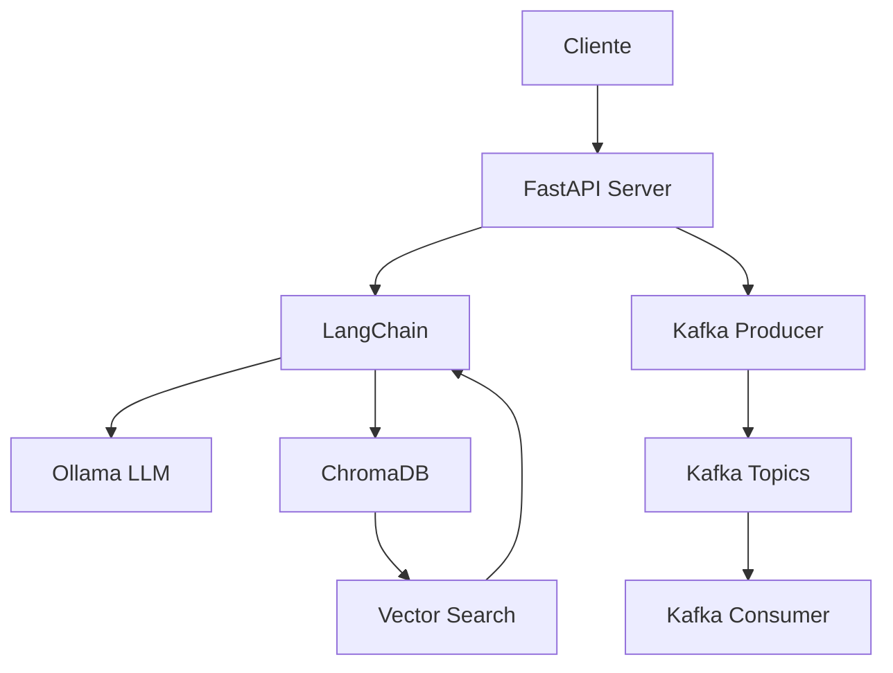
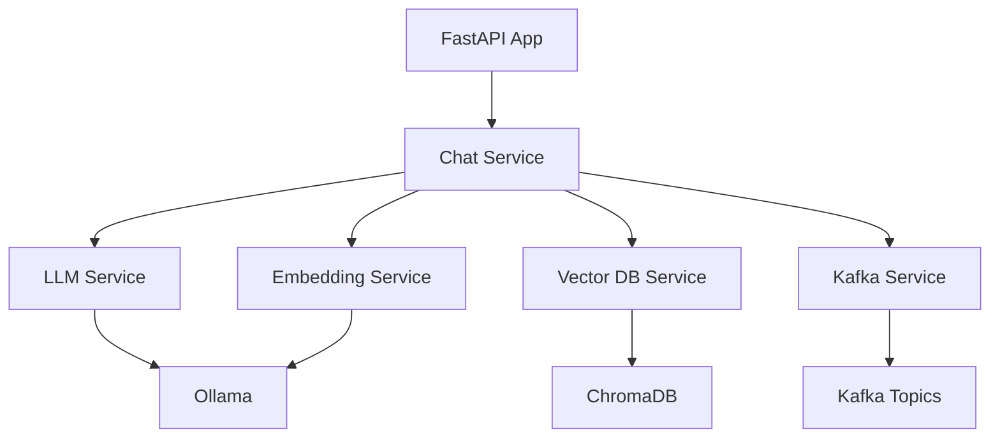

# AI Server - Sistema Integrado con LangChain, Ollama y Kafka

Sistema completo de inteligencia artificial que combina **FastAPI**, **LangChain**, **Ollama** y **Apache Kafka** para proporcionar un servidor de IA escalable con capacidades de procesamiento en tiempo real, base de datos vectorial y distribución de mensajes.

## 🚀 Características Principales

- **🌐 API REST Completa**: FastAPI con documentación automática (Swagger/ReDoc)
- **🤖 Modelos de IA Locales**: Integración nativa con Ollama
- **🧠 Base de Datos Vectorial**: ChromaDB para búsqueda semántica y contexto
- **📡 Apache Kafka**: Streaming de respuestas y distribución de mensajes
- **⚡ Respuestas Streaming**: Comunicación en tiempo real
- **🔍 Health Monitoring**: Verificación completa de todos los servicios
- **📄 Gestión de Documentos**: Procesamiento automático de embeddings
- **💬 Contexto Conversacional**: Mantenimiento de historial de conversaciones

## 🏗️ Arquitectura del Sistema



## ⚙️ Instalación y Configuración

### 📋 Prerrequisitos

- **Python 3.11+**
- **Docker y Docker Compose** (para Kafka)
- **Ollama** instalado y ejecutándose
- **Git** (para clonar el repositorio)

### 🔽 Instalación Rápida

#### 1. Preparar Ollama

```powershell
# Instalar Ollama (Windows)
# Descargar desde: https://ollama.ai/download

# Descargar modelos necesarios
ollama pull phi3:3.8b
ollama pull nomic-embed-text

# Verificar modelos
ollama list
```

#### 2. Configurar Entorno Python

```powershell
# Navegar al directorio del servidor
cd server-python

# Crear entorno virtual
python -m venv .venv

# Activar entorno virtual (Windows)
.venv\Scripts\activate

# Actualizar pip
python -m pip install --upgrade pip

# Instalar dependencias
pip install -r requirements.txt
```

#### 3. Configurar Variables de Entorno

```powershell
# Copiar archivo de configuración
copy .env.example .env

# Editar .env si es necesario (valores por defecto funcionan)
```

#### 4. Iniciar Servicios Kafka (Opcional)

```powershell
# Desde el directorio raíz del proyecto
docker-compose up -d

# Verificar servicios
docker-compose ps

# Crear topics de Kafka
cd server-python
python create_kafka_topics.py
```

#### 5. Iniciar el Servidor

```powershell
# Método 1: Script directo
python run.py

# Método 2: Con utilidades
python utils.py start

# Método 3: Desarrollo con recarga
uvicorn app.main:app --host 0.0.0.0 --port 8000 --reload
```

### 🌐 URLs Importantes

- **API Principal**: http://localhost:8000
- **Documentación Swagger**: http://localhost:8000/docs
- **ReDoc**: http://localhost:8000/redoc
- **Kafka UI**: http://localhost:8080 (si Docker está ejecutándose)
- **Health Check**: http://localhost:8000/health

## 🔗 API y Uso del Sistema

### 📚 Documentación Interactiva

- **Swagger UI**: http://localhost:8000/docs
- **ReDoc**: http://localhost:8000/redoc

### 🎯 Endpoints Principales

#### 💬 Chat y Conversación

```powershell
# Chat básico
curl -X POST "http://localhost:8000/chat/" `
  -H "Content-Type: application/json" `
  -d '{"message": "¿Cómo funciona la inteligencia artificial?", "use_context": false, "temperature": 0.7}'

# Chat con contexto vectorial
curl -X POST "http://localhost:8000/chat/" `
  -H "Content-Type: application/json" `
  -d '{"message": "Explica machine learning", "use_context": true, "conversation_id": "conv_123"}'

# Chat streaming en tiempo real
curl -X POST "http://localhost:8000/chat/stream" `
  -H "Content-Type: application/json" `
  -d '{"message": "Escribe un poema sobre la tecnología", "use_context": false}'

# Historial de conversación
curl "http://localhost:8000/chat/history/conv_123"
```

#### 📄 Gestión de Documentos

```powershell
# Añadir documento al contexto
curl -X POST "http://localhost:8000/documents/" `
  -H "Content-Type: application/json" `
  -d '{"content": "Información importante sobre el proyecto...", "metadata": {"tipo": "documentacion"}, "conversation_id": "conv_123"}'

# Estadísticas de documentos
curl "http://localhost:8000/documents/stats"
```

#### 🔍 Monitoreo y Salud

```powershell
# Health check general
curl "http://localhost:8000/health/"

# Estado específico de Kafka
curl "http://localhost:8000/health/kafka"

# Información de modelos
curl "http://localhost:8000/health/models"

# Información del sistema
curl "http://localhost:8000/"
```

## 📡 Integración con Apache Kafka

### 🎯 Topics Configurados

El sistema crea automáticamente los siguientes topics:

| Topic                    | Descripción                | Uso                               |
| ------------------------ | -------------------------- | --------------------------------- |
| `ia-responses`           | Respuestas completas de IA | Almacena conversaciones completas |
| `ia-responses-streaming` | Fragmentos streaming       | Chunks en tiempo real             |

### 📝 Formato de Mensajes

#### Topic: `ia-responses`

```json
{
  "conversation_id": "conv_123",
  "user_message": "¿Cómo funciona Kafka?",
  "ai_response": "Apache Kafka es una plataforma de streaming distribuida...",
  "context_used": true,
  "metadata": {
    "temperature": 0.7,
    "model": "phi3:3.8b",
    "use_context": true,
    "streaming": false,
    "timestamp": "2025-07-08T10:30:00.000Z"
  }
}
```

#### Topic: `ia-responses-streaming`

```json
{
  "conversation_id": "conv_123",
  "chunk": "Apache Kafka",
  "chunk_index": 0,
  "is_final": false,
  "timestamp": "2025-07-08T10:30:00.000Z",
  "message_type": "streaming_chunk"
}
```

### 🔄 Consumir Mensajes

```powershell
# Usar el script de ejemplo incluido
python kafka_consumer_example.py

# Consumir con kafka-console-consumer (Docker)
docker exec -it kafka kafka-console-consumer `
  --bootstrap-server localhost:9092 `
  --topic ia-responses `
  --from-beginning

# Ver todos los topics disponibles
docker exec -it kafka kafka-topics `
  --bootstrap-server localhost:9092 `
  --list
```

### 🖥️ Kafka UI - Interfaz Web

Accede a **http://localhost:8080** para:

- 📊 **Monitorear Topics**: Ver mensajes en tiempo real
- 📈 **Estadísticas**: Throughput, lag, particiones
- ⚙️ **Configuración**: Gestionar topics y configuraciones
- 🔍 **Búsqueda**: Filtrar mensajes por criterios

### ⚡ Scripts de Utilidad

```powershell
# Verificar conectividad con Kafka
python verify_kafka.py

# Crear topics manualmente
python create_kafka_topics.py

# Cliente consumidor de ejemplo
python kafka_consumer_example.py
```

## 🛠️ Desarrollo y Arquitectura

### 📁 Estructura del Proyecto

```
python-kafka/
├── 📄 docker-compose.yml           # Configuración de Kafka
├── 📄 README_KAFKA.md             # Documentación principal
└── server-python/
    ├── 📁 app/                    # Código principal de la aplicación
    │   ├── 📄 main.py             # Aplicación FastAPI
    │   ├── 📄 config.py           # Configuración centralizada
    │   ├── 📄 models.py           # Modelos Pydantic
    │   ├── 📄 dependencies.py     # Inyección de dependencias
    │   ├── 📄 logging_config.py   # Configuración de logs
    │   ├── 📁 api/                # Endpoints REST
    │   │   ├── 📄 chat.py         # Endpoints de chat
    │   │   ├── 📄 documents.py    # Gestión de documentos
    │   │   └── 📄 health.py       # Health checks
    │   └── 📁 services/           # Lógica de negocio
    │       ├── 📄 chat_service.py     # Orquestador principal
    │       ├── 📄 llm_service.py      # Integración Ollama
    │       ├── 📄 embedding_service.py # Procesamiento embeddings
    │       ├── 📄 vector_db_service.py # ChromaDB
    │       └── 📄 kafka_service.py    # Integración Kafka
    ├── 📁 chroma_db/             # Base de datos vectorial
    ├── 📁 logs/                  # Archivos de log
    ├── 📄 requirements.txt       # Dependencias Python
    ├── 📄 .env.example          # Variables de entorno
    ├── 📄 run.py                # Punto de entrada
    ├── 📄 utils.py              # Utilidades de desarrollo
    ├── 📄 diagnose.py           # Script de diagnóstico
    ├── 📄 verify_kafka.py       # Verificación Kafka
    ├── 📄 create_kafka_topics.py # Creación de topics
    ├── 📄 kafka_consumer_example.py # Cliente consumidor
    └── 📄 client_example.py     # Cliente de prueba
```

### ⚙️ Configuraciones Disponibles

| Variable                   | Descripción             | Valor por Defecto            |
| -------------------------- | ----------------------- | ---------------------------- |
| `APP_NAME`                 | Nombre de la aplicación | `"AI Server with LangChain"` |
| `DEBUG`                    | Modo debug              | `false`                      |
| `HOST`                     | Host del servidor       | `"0.0.0.0"`                  |
| `PORT`                     | Puerto del servidor     | `8000`                       |
| `OLLAMA_BASE_URL`          | URL de Ollama           | `"http://localhost:11434"`   |
| `LLM_MODEL`                | Modelo de lenguaje      | `"phi3:3.8b"`                |
| `EMBEDDING_MODEL`          | Modelo de embeddings    | `"nomic-embed-text"`         |
| `CHROMA_PERSIST_DIRECTORY` | Directorio ChromaDB     | `"./chroma_db"`              |
| `KAFKA_BOOTSTRAP_SERVERS`  | Servidores Kafka        | `["localhost:9092"]`         |
| `KAFKA_ENABLE`             | Habilitar Kafka         | `true`                       |
| `LOG_LEVEL`                | Nivel de logging        | `"INFO"`                     |

### 🏗️ Arquitectura de Servicios



#### 🔧 Servicios Principales

1. **ChatService**: Orquestador central que coordina todos los servicios
2. **LLMService**: Maneja la comunicación con Ollama para generación de texto
3. **EmbeddingService**: Genera embeddings para documentos y consultas
4. **VectorDBService**: Gestiona ChromaDB para búsqueda semántica
5. **KafkaService**: Distribuye mensajes a través de Apache Kafka

### 🚀 Scripts de Desarrollo

```powershell
# Configuración automática del entorno
python utils.py setup

# Verificar estado de todos los servicios
python utils.py check

# Iniciar servidor en modo desarrollo
python utils.py start --reload

# Ejecutar diagnóstico completo
python diagnose.py

# Probar cliente de ejemplo
python client_example.py

# Verificar integración Kafka
python verify_kafka.py
```

## 🔧 Resolución de Problemas

### 🚨 Diagnóstico Automático

Ejecuta primero el script de diagnóstico para identificar problemas:

```powershell
# Diagnóstico completo del sistema
python diagnose.py

# Verificación específica de Kafka
python verify_kafka.py

# Verificación general de servicios
python utils.py check
```

### ❌ Problemas Comunes

#### 1. **Error: "BaseSettings has been moved to pydantic-settings"**

```powershell
# Instalar pydantic-settings
pip install pydantic-settings

# O reinstalar todas las dependencias
pip install -r requirements.txt --force-reinstall

# Verificar instalación
python -c "from pydantic_settings import BaseSettings; print('✅ OK')"
```

#### 2. **Kafka no se conecta**

```powershell
# Verificar estado de Docker
docker-compose ps

# Ver logs de Kafka
docker-compose logs kafka

# Reiniciar servicios
docker-compose restart

# Verificar conectividad
python verify_kafka.py
```

#### 3. **Ollama no disponible**

```powershell
# Verificar que Ollama esté ejecutándose
ollama list

# Descargar modelos si faltan
ollama pull phi3:3.8b
ollama pull nomic-embed-text

# Verificar conectividad
curl http://localhost:11434/api/tags
```

#### 4. **Puerto en uso**

```powershell
# Cambiar puerto en .env
echo "PORT=8001" >> .env

# O especificar puerto diferente
python utils.py start --port 8001

# Verificar qué proceso usa el puerto
netstat -ano | findstr :8000
```

#### 5. **Problemas de permisos**

```powershell
# Verificar permisos de directorios
# Asegurar que el usuario tiene acceso a:
# - chroma_db/
# - logs/
# - .env

# Crear directorios si no existen
mkdir chroma_db
mkdir logs
```

### 📊 Monitoreo y Logs

#### Ubicación de Logs

- **Consola**: Nivel INFO
- **Archivo**: `logs/app.log` (Nivel DEBUG)
- **Docker Compose**: `docker-compose logs`

#### Health Checks

```powershell
# Estado general
curl http://localhost:8000/health/

# Estado de Kafka específicamente
curl http://localhost:8000/health/kafka

# Información de modelos
curl http://localhost:8000/health/models

# Estadísticas de documentos
curl http://localhost:8000/documents/stats
```

### 🔍 Comandos de Depuración

```powershell
# Ver todos los procesos relacionados
netstat -ano | findstr :8000
netstat -ano | findstr :9092

# Verificar Docker
docker ps
docker-compose ps

# Logs detallados
docker-compose logs -f kafka
docker-compose logs -f kafka-ui

# Limpiar datos de Kafka (si es necesario)
docker-compose down -v
docker-compose up -d
```

## 🔄 Flujo de Trabajo Típico

### 🚀 Inicio Rápido (5 minutos)

```powershell
# 1. Clonar y navegar
git clone [repo-url]
cd python-kafka/server-python

# 2. Configurar entorno
python -m venv .venv
.venv\Scripts\activate
pip install -r requirements.txt

# 3. Preparar Ollama
ollama pull phi3:3.8b
ollama pull nomic-embed-text

# 4. Iniciar Kafka (opcional)
cd ..
docker-compose up -d
cd server-python

# 5. Iniciar servidor
python run.py
```

### 💡 Ejemplos de Uso

#### Conversación Básica

```powershell
# POST /chat/
{
  "message": "Explica qué es machine learning",
  "use_context": false,
  "temperature": 0.7
}
```

#### Conversación con Contexto

```powershell
# 1. Añadir documento
# POST /documents/
{
  "content": "Machine Learning es una rama de la IA...",
  "conversation_id": "conv_001"
}

# 2. Chat con contexto
# POST /chat/
{
  "message": "¿Puedes profundizar más sobre ML?",
  "use_context": true,
  "conversation_id": "conv_001"
}
```

#### Streaming en Tiempo Real

```powershell
# POST /chat/stream
{
  "message": "Escribe un artículo sobre IA",
  "use_context": true
}
# Respuesta llega por chunks en tiempo real
```

## 🤝 Contribución

### 📝 Cómo Contribuir

1. **Fork** el repositorio
2. **Crear** rama de feature (`git checkout -b feature/nueva-funcionalidad`)
3. **Commit** los cambios (`git commit -am 'Añadir nueva funcionalidad'`)
4. **Push** a la rama (`git push origin feature/nueva-funcionalidad`)
5. **Crear** Pull Request

### 🧪 Testing

```powershell
# Ejecutar pruebas básicas
python client_example.py

# Pruebas de integración
python test_integration.py

# Verificar Kafka
python verify_kafka.py

# Diagnóstico completo
python diagnose.py
```

### 📋 Checklist para Contribuir

- [ ] Código sigue las convenciones del proyecto
- [ ] Documentación actualizada
- [ ] Tests pasan correctamente
- [ ] No se rompe la funcionalidad existente
- [ ] Variables de entorno documentadas

## 📞 Soporte y Comunidad

### 🔗 Enlaces Útiles

- **Documentación FastAPI**: https://fastapi.tiangolo.com/
- **LangChain Docs**: https://python.langchain.com/
- **Ollama GitHub**: https://github.com/ollama/ollama
- **Apache Kafka**: https://kafka.apache.org/
- **ChromaDB**: https://docs.trychroma.com/

### 📊 Información del Sistema

- **Versión**: 1.0.0
- **Python**: 3.11+
- **Licencia**: MIT
- **Última actualización**: Julio 2025

---

## 📄 Resumen de Comandos

```powershell
# Instalación y configuración
python -m venv .venv && .venv\Scripts\activate
pip install -r requirements.txt
copy .env.example .env

# Preparar modelos
ollama pull phi3:3.8b && ollama pull nomic-embed-text

# Iniciar servicios
docker-compose up -d  # Kafka (opcional)
python run.py         # Servidor IA

# Verificación
python utils.py check
python verify_kafka.py
curl http://localhost:8000/health/

# Desarrollo
python utils.py start --reload
python diagnose.py
python client_example.py
```

**🎉 ¡El sistema está listo para usar! Visita http://localhost:8000/docs para comenzar.**
