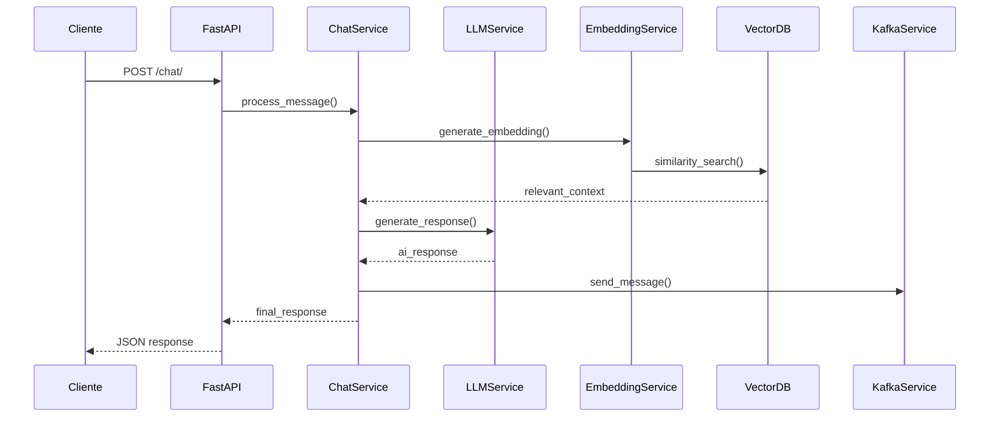

# 🤖 AI Server - Servidor de Inteligencia Artificial

Servidor FastAPI de alta performance que integra **LangChain**, **Ollama** y **ChromaDB** para proporcionar capacidades avanzadas de procesamiento de lenguaje natural con contexto vectorial y streaming en tiempo real.

> 📋 **Nota**: Para la documentación completa del sistema incluyendo Kafka, consulta [README_KAFKA.md](../README_KAFKA.md)

## ✨ Características del Servidor

- 🚀 **FastAPI**: Framework moderno con documentación automática
- 🧠 **LangChain**: Orquestación avanzada de LLMs
- 🏠 **Ollama**: Modelos de IA ejecutándose localmente
- 🔍 **ChromaDB**: Base de datos vectorial para búsqueda semántica
- ⚡ **Streaming**: Respuestas en tiempo real
- 💬 **Contexto Conversacional**: Mantiene historial de conversaciones
- 📄 **Gestión de Documentos**: Procesamiento automático de embeddings
- 🔄 **Integración Kafka**: Distribución de mensajes (opcional)

## 🛠️ Modelos de IA Utilizados

| Componente        | Modelo             | Propósito                        |
| ----------------- | ------------------ | -------------------------------- |
| **LLM Principal** | `phi3:3.8b`        | Generación de texto y respuestas |
| **Embeddings**    | `nomic-embed-text` | Vectorización de documentos      |

## ⚡ Inicio Rápido

### 1. Prerrequisitos

```powershell
# Verificar Python
python --version  # Requiere 3.11+

# Instalar y configurar Ollama
ollama pull phi3:3.8b
ollama pull nomic-embed-text
```

### 2. Instalación

```powershell
# Crear entorno virtual
python -m venv .venv
.venv\Scripts\activate

# Instalar dependencias
pip install -r requirements.txt

# Configurar variables de entorno
copy .env.example .env
```

### 3. Iniciar Servidor

```powershell
# Método directo
python run.py

# Con utilidades (recomendado)
python utils.py start

# Desarrollo con recarga automática
python utils.py start --reload
```

### 4. Verificar Funcionamiento

```powershell
# Health check
curl http://localhost:8000/health/

# Documentación interactiva
# Abrir: http://localhost:8000/docs
```

## 🎯 API Endpoints

### 📋 Documentación Automática

- **Swagger UI**: http://localhost:8000/docs
- **ReDoc**: http://localhost:8000/redoc

### 💬 Chat y Conversación

```powershell
# Chat básico
curl -X POST "http://localhost:8000/chat/" `
  -H "Content-Type: application/json" `
  -d '{"message": "¿Cómo estás?", "use_context": false, "temperature": 0.7}'

# Chat con contexto vectorial
curl -X POST "http://localhost:8000/chat/" `
  -H "Content-Type: application/json" `
  -d '{"message": "Explica machine learning", "use_context": true, "conversation_id": "conv-123"}'

# Streaming en tiempo real
curl -X POST "http://localhost:8000/chat/stream" `
  -H "Content-Type: application/json" `
  -d '{"message": "Escribe un poema", "use_context": false}'

# Historial de conversación
curl "http://localhost:8000/chat/history/conv-123"
```

### 📄 Gestión de Documentos

```powershell
# Añadir documento al contexto
curl -X POST "http://localhost:8000/documents/" `
  -H "Content-Type: application/json" `
  -d '{"content": "Información importante...", "metadata": {"tipo": "ejemplo"}, "conversation_id": "conv-123"}'

# Estadísticas de documentos
curl "http://localhost:8000/documents/stats"
```

### 🔍 Monitoreo y Salud

```powershell
# Health check general
curl "http://localhost:8000/health/"

# Estado de modelos
curl "http://localhost:8000/health/models"

# Información del sistema
curl "http://localhost:8000/"
```

## ⚙️ Configuración

### 🔧 Variables de Entorno

Crea un archivo `.env` basado en `.env.example`:

```env
# Servidor
HOST=0.0.0.0
PORT=8000
DEBUG=false
LOG_LEVEL=INFO

# Ollama
OLLAMA_BASE_URL=http://localhost:11434
LLM_MODEL=phi3:3.8b
EMBEDDING_MODEL=nomic-embed-text

# ChromaDB
CHROMA_PERSIST_DIRECTORY=./chroma_db
COLLECTION_NAME=conversation_context

# Kafka (opcional)
KAFKA_ENABLE=true
KAFKA_BOOTSTRAP_SERVERS=["localhost:9092"]
```

### 🏗️ Personalización de Servicios

| Archivo                         | Propósito            | Personalización            |
| ------------------------------- | -------------------- | -------------------------- |
| `config.py`                     | Configuración global | Variables de entorno, URLs |
| `services/chat_service.py`      | Lógica principal     | Flujo de conversación      |
| `services/llm_service.py`       | Integración Ollama   | Prompts, modelos           |
| `services/embedding_service.py` | Vectorización        | Chunk size, estrategias    |
| `services/vector_db_service.py` | ChromaDB             | Colecciones, búsquedas     |
| `api/chat.py`                   | Endpoints chat       | Validaciones, respuestas   |

## 🏗️ Arquitectura del Servidor

### 📁 Estructura de Archivos

```
server-python/
├── 📁 app/                    # Código principal
│   ├── 📄 main.py             # Aplicación FastAPI
│   ├── 📄 config.py           # Configuración centralizada
│   ├── 📄 models.py           # Modelos Pydantic
│   ├── 📄 dependencies.py     # Inyección de dependencias
│   ├── 📄 logging_config.py   # Configuración de logs
│   ├── 📁 api/                # Endpoints REST
│   │   ├── 📄 chat.py         # Rutas de chat
│   │   ├── 📄 documents.py    # Rutas de documentos
│   │   └── 📄 health.py       # Health checks
│   └── 📁 services/           # Lógica de negocio
│       ├── 📄 chat_service.py     # Orquestador principal
│       ├── 📄 llm_service.py      # Comunicación con Ollama
│       ├── 📄 embedding_service.py # Generación de embeddings
│       ├── 📄 vector_db_service.py # Gestión ChromaDB
│       └── 📄 kafka_service.py    # Integración Kafka
├── 📁 chroma_db/             # Base de datos vectorial
├── 📁 logs/                  # Archivos de log
├── 📄 requirements.txt       # Dependencias Python
├── 📄 .env.example          # Template configuración
├── 📄 run.py                # Punto de entrada
├── 📄 utils.py              # Scripts de utilidad
├── 📄 diagnose.py           # Diagnóstico del sistema
└── 📄 client_example.py     # Cliente de prueba
```

### 🔄 Flujo de Procesamiento



### 🧩 Servicios Principales

#### 1. **ChatService** - Orquestador Central

- Coordina todos los servicios
- Gestiona flujo de conversación
- Mantiene contexto entre mensajes

#### 2. **LLMService** - Integración con Ollama

- Comunicación con modelos de lenguaje
- Gestión de prompts y respuestas
- Soporte para streaming

#### 3. **EmbeddingService** - Vectorización

- Genera embeddings de documentos
- Procesa consultas para búsqueda
- Optimiza chunks de texto

#### 4. **VectorDBService** - ChromaDB

- Almacena embeddings
- Búsqueda de similitud
- Gestión de colecciones

#### 5. **KafkaService** - Distribución (Opcional)

- Publica mensajes a topics
- Maneja reconexiones
- Batch y streaming

## 🛠️ Scripts de Utilidad

### 📋 Scripts Disponibles

```powershell
# Configuración automática
python utils.py setup           # Instala dependencias y configura

# Verificación del sistema
python utils.py check           # Verifica todos los servicios
python diagnose.py              # Diagnóstico detallado

# Ejecución del servidor
python utils.py start           # Inicia servidor
python utils.py start --reload  # Con recarga automática
python run.py                   # Método directo

# Pruebas y ejemplos
python client_example.py        # Cliente de prueba
python verify_kafka.py          # Verificar Kafka
python test_integration.py      # Pruebas de integración
```

### 🔧 Utilidades de Desarrollo

```powershell
# Ver logs en tiempo real
Get-Content -Wait -Tail 10 logs/app.log

# Verificar estado de servicios
python -c "from app.dependencies import get_chat_service; print(get_chat_service().health_check())"

# Probar conectividad Ollama
curl http://localhost:11434/api/tags

# Limpiar base de datos vectorial
Remove-Item -Recurse -Force chroma_db
```

## 🚨 Resolución de Problemas

### 🔍 Diagnóstico Rápido

```powershell
# Ejecutar diagnóstico automático
python diagnose.py

# Verificar configuración
python utils.py check

# Comprobar servicios individualmente
python -c "from app.dependencies import get_chat_service; service = get_chat_service(); print(service.health_check())"
```

### ❌ Errores Comunes

| Error                         | Causa                | Solución                        |
| ----------------------------- | -------------------- | ------------------------------- |
| `BaseSettings has been moved` | Pydantic v2          | `pip install pydantic-settings` |
| `Ollama not running`          | Ollama no iniciado   | `ollama serve`                  |
| `Model not found`             | Modelo no descargado | `ollama pull phi3:3.8b`         |
| `Port already in use`         | Puerto ocupado       | Cambiar `PORT` en `.env`        |
| `ChromaDB permission denied`  | Permisos directorio  | Verificar permisos `chroma_db/` |

### 🔧 Comandos de Diagnóstico

```powershell
# Verificar Ollama
ollama list
curl http://localhost:11434/api/tags

# Verificar puerto
netstat -ano | findstr :8000

# Verificar logs
Get-Content logs/app.log -Tail 20

# Test de dependencias
python -c "import fastapi, langchain, chromadb, ollama; print('✅ Todas las dependencias OK')"
```

### 📊 Monitoreo en Tiempo Real

```powershell
# Logs del servidor
Get-Content -Wait logs/app.log

# Estado de salud
curl http://localhost:8000/health/

# Métricas de documentos
curl http://localhost:8000/documents/stats

# Test básico
curl -X POST http://localhost:8000/chat/ -H "Content-Type: application/json" -d '{"message":"test"}'
```

## 🎯 Casos de Uso

### 💼 Implementaciones Típicas

#### 1. **Chatbot Corporativo**

```python
# Configurar con documentos de empresa
POST /documents/
{
  "content": "Manual de procedimientos...",
  "metadata": {"department": "HR"}
}

# Chat con contexto corporativo
POST /chat/
{
  "message": "¿Cuál es la política de vacaciones?",
  "use_context": true
}
```

#### 2. **Asistente de Documentación**

```python
# Cargar documentación técnica
POST /documents/
{
  "content": "Documentación de API...",
  "metadata": {"type": "api_docs"}
}

# Consultas específicas
POST /chat/
{
  "message": "¿Cómo implementar autenticación?",
  "use_context": true
}
```

#### 3. **Sistema de Conocimiento**

```python
# Múltiples fuentes de información
# Streaming para respuestas largas
POST /chat/stream
{
  "message": "Explica arquitectura de microservicios",
  "use_context": true
}
```

## 📈 Extensiones y Mejoras

### 🔮 Funcionalidades Avanzadas

- **🔐 Autenticación**: Agregar JWT/OAuth
- **🌐 Multi-idioma**: Soporte para múltiples idiomas
- **📊 Analytics**: Métricas de uso y performance
- **🔄 Cache**: Redis para respuestas frecuentes
- **🛡️ Rate Limiting**: Control de velocidad de requests
- **📱 WebSocket**: Chat en tiempo real
- **🗃️ Base de Datos**: PostgreSQL para persistencia
- **☁️ Cloud**: Despliegue en AWS/Azure/GCP

### 🧩 Integración con Otros Servicios

```python
# Ejemplo: Añadir nuevo servicio
# app/services/translation_service.py
class TranslationService:
    async def translate(self, text: str, target_lang: str) -> str:
        # Implementar traducción
        pass

# app/api/translation.py
@router.post("/translate")
async def translate_text(request: TranslationRequest):
    # Endpoint de traducción
    pass
```

## 📚 Referencias y Recursos

### 🔗 Documentación Oficial

- **FastAPI**: https://fastapi.tiangolo.com/
- **LangChain**: https://python.langchain.com/
- **Ollama**: https://github.com/ollama/ollama
- **ChromaDB**: https://docs.trychroma.com/
- **Pydantic**: https://docs.pydantic.dev/

### 📖 Guías Relacionadas

- `../README_KAFKA.md` - Documentación completa del sistema
- `QUICKSTART.md` - Guía de inicio rápido
- `.env.example` - Variables de entorno disponibles

---

## 📞 Información del Proyecto

**🏷️ Versión**: 1.0.0  
**🐍 Python**: 3.11+  
**📄 Licencia**: MIT  
**📅 Última actualización**: Julio 2025

### 🚀 Comandos de Resumen

```powershell
# Setup completo en una línea
python -m venv .venv && .venv\Scripts\activate && pip install -r requirements.txt && copy .env.example .env && python run.py

# Verificación rápida
python utils.py check && curl http://localhost:8000/health/

# Documentación local
# http://localhost:8000/docs
```
